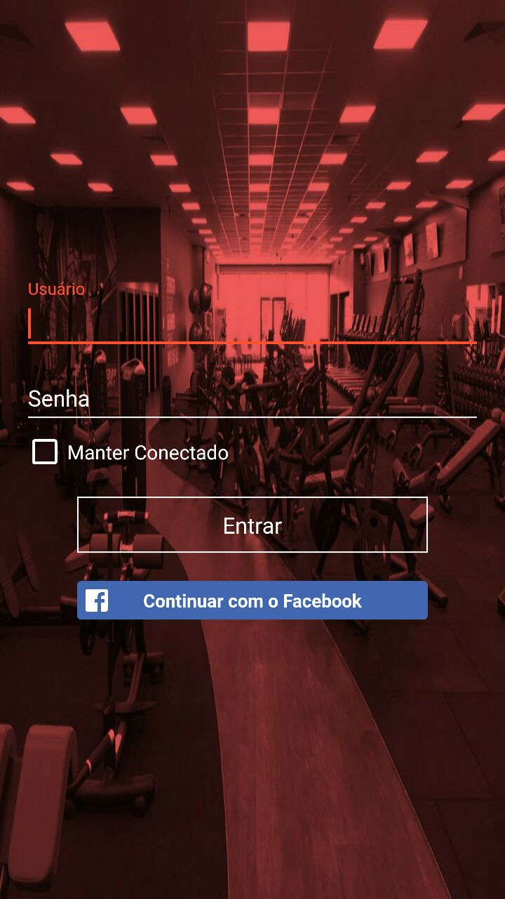
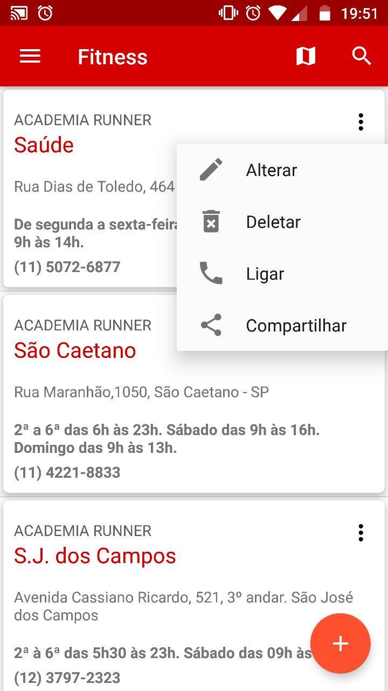
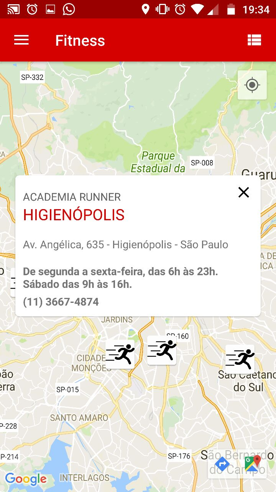
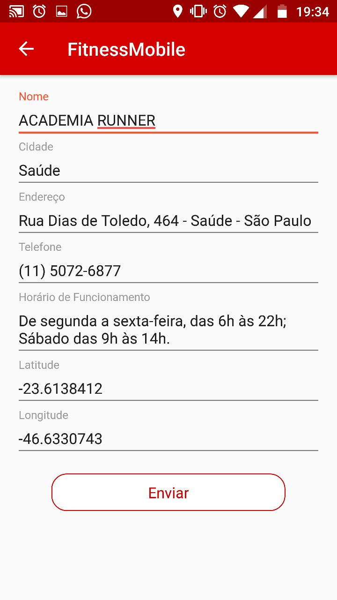

Fitness Mobile - TCC - Android FIAP
==============================

O aplicativo Fitness Mobile contêm as seguintes tecnologias aplicadas durante os estudos em sala de aula. 

* [Retrofit](http://square.github.io/retrofit/)
* [RxJaxa](https://github.com/ReactiveX/RxJava)
* [Stetho](http://facebook.github.io/stetho/)
* [Fabric](https://get.fabric.io/)
* [FirebaseAnalytics](https://firebase.google.com/docs/analytics/?hl=pt-br)
* [Butter Knife](http://jakewharton.github.io/butterknife/)
* [Facebook Android SDK](https://developers.facebook.com/docs/android/)
* [Maps Android API](https://developers.google.com/maps/documentation/android-api/?hl=pt-br)
* [SQLite](https://developer.android.com/training/basics/data-storage/databases.html?hl=pt-br)
* [RecyclerView](https://developer.android.com/training/material/lists-cards.html?hl=pt-br)
* [CardView](https://developer.android.com/reference/android/support/v7/widget/CardView.html?hl=pt-br)
* [Fragment](https://developer.android.com/guide/components/fragments.html?hl=pt-br)
* [Search View](https://developer.android.com/training/search/setup.html)
* [PopupWindow](https://developer.android.com/reference/android/widget/PopupWindow.html)
* [PopupMenu](https://developer.android.com/guide/topics/ui/menus.html?hl=pt-br)

Telas da aplicação
--------------

Contato
--------------
> RM 31773 | edubossa@gmail.com | (11) 94606-5413
 

SlideShare 
--------------

[https://pt.slideshare.net/edubossa/android-fiap-13mob](https://pt.slideshare.net/edubossa/android-fiap-13mob)
